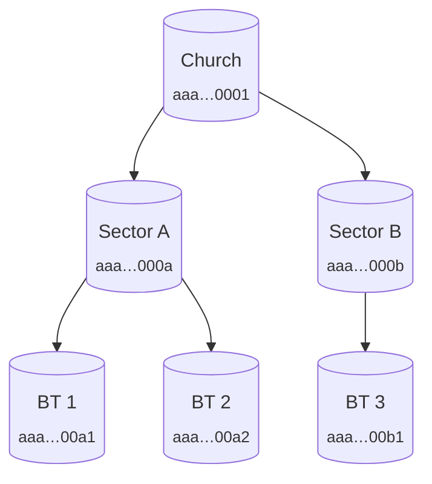
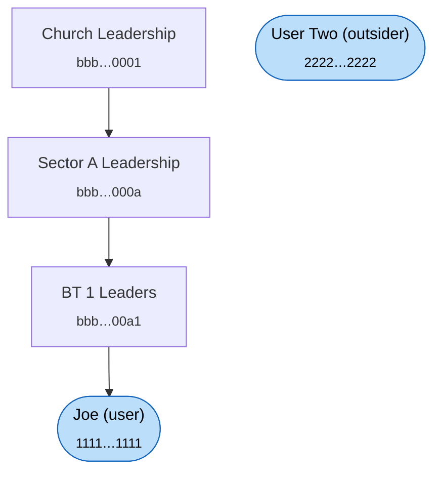

# System Architecture (Visual Overview)

A picture-first companion to [`access-control-implementation.md`](./access-control-implementation.md). When you want to *see* what's been built — open this. When you want to *do* something — that one.

> **How to view this file with the diagrams rendered:**
> - **On GitHub** — every Mermaid block below renders automatically when you open this file in the browser. No setup.
> - **In VS Code** — install the [Markdown Preview Mermaid Support](https://marketplace.visualstudio.com/items?itemName=bierner.markdown-mermaid) extension, then `Cmd/Ctrl+Shift+V` on this file.
> - **In Supabase Studio** — for the live schema, the dashboard has a built-in visualizer: <https://supabase.com/dashboard/project/iwylzmjkndsvhpygpcqo/database/schemas>

---

## 1. Phase status

```mermaid
graph LR
  P0([Phase 0<br/>Foundation]):::done --> P1
  P1([Phase 1<br/>Resources &amp; principals]):::done --> P2
  P2([Phase 2<br/>Policies &amp; can&#40;&#41;]):::done --> P3
  P3([Phase 3<br/>Grant logic &amp; RLS]):::done --> P4
  P4([Phase 4<br/>Flutter login]):::todo --> P5
  P5([Phase 5<br/>Permission cache]):::skip --> P6
  P6([Phase 6<br/>Stats schema]):::todo --> P7
  P7([Phase 7<br/>Stats screen]):::todo --> P8
  P8([Phase 8<br/>Grant UI]):::skip

  classDef done fill:#90ee90,stroke:#2e7d32,color:#000
  classDef todo fill:#fff59d,stroke:#f57f17,color:#000
  classDef skip fill:#e0e0e0,stroke:#757575,color:#000
```



- 🟢 **Green** — done, applied to remote, tested.
- 🟡 **Yellow** — next up.
- ⚪ **Grey** — explicitly deferred per the MVP scope discussion (Phase 5 cache and Phase 8 admin UI can wait until they're actually painful).

---

## 2. Database schema (what's deployed right now)

```mermaid
erDiagram
  resources ||--o{ resources         : "parent_id (self-tree)"
  principals ||--o{ principal_members : "as parent"
  principals ||--o{ principal_members : "as member"
  principals ||--|| app_users         : "same id (user-principals)"
  auth_users ||--|| app_users         : "same id (auth link)"
  principals ||--o{ policies          : "principal_id"
  resources  ||--o{ policies          : "resource_id"
  app_users  ||--o{ policies          : "granted_by"

  resources {
    uuid id PK
    resource_type type "church|sector|bible_talk"
    uuid parent_id FK "nullable; null = root"
    text name
    timestamptz created_at
  }
  principals {
    uuid id PK
    principal_kind kind "user|group"
    text name
    timestamptz created_at
  }
  principal_members {
    uuid parent_id PK_FK
    uuid member_id PK_FK "check: parent != member"
  }
  app_users {
    uuid id PK_FK "= principals.id = auth.users.id"
    text display_name
    timestamptz created_at
  }
  policies {
    uuid id PK
    uuid principal_id FK
    app_permission permission "6 values: stats.* + grant + grant-grant"
    uuid resource_id FK
    uuid granted_by FK "nullable; audit only"
    timestamptz granted_at
  }
  auth_users {
    uuid id PK "Supabase-managed"
    text email
    text encrypted_password
  }
```

### How to read it

- **`resources` is a tree.** One column, `parent_id`, points back at the same table. A `church` has no parent (`null`). A `sector` parents to a `church`. A `bible_talk` parents to a `sector`.
- **`principals` is also a tree-ish thing**, but the edges live in a separate table (`principal_members`) because a principal can have multiple parents in principle (DAG-safe).
- **`app_users.id` does double duty.** The same UUID identifies the row in `auth.users` (Supabase Auth's table), in `principals` (so users can hold policies), and in `app_users` (for display name). That's why `auth.uid()` is directly usable as a principal id anywhere in the system.
- **`policies` is the entire access-control story.** Three meaningful columns: who, what, where. Everything else (`granted_by`, `granted_at`) is audit.

---

## 3. Seed data — the trees, drawn

The seed loads two parallel trees: one of resources (the church org chart in real-world terms) and one of principals (the leadership chart).

### Resources



### Principals (groups + users)



User Two is intentionally floating — outside any group. He's the "outsider gets nothing" test fixture.

### How the trees connect — the policies

These five rows are what gives anyone any access to anything. (Phase 3 added the last two.)

| Principal | Permission | Resource | Effect |
|---|---|---|---|
| Church Leadership | `stats.read` | Church | Everyone in any sub-group can read stats on everything. |
| Sector A Leadership | `stats.write` | Sector A | Anyone in Sector A's leadership tree can write stats on BT 1 + BT 2. |
| Joe (direct) | `stats.delete` | BT 1 | Joe specifically can delete BT 1 stats. |
| Joe (direct) | `stats.write` | Sector A | Joe can grant stats.write within Sector A. |
| Joe (direct) | `grant` | Sector A | Joe can hand out permissions inside Sector A. |

When `can(Joe, X, Y)` runs, it walks **both** trees simultaneously: Joe's principal ancestry (Joe → BT1 Ldr → Sector A Ldr → Church Ldr) and Y's resource ancestry (e.g. BT 1 → Sector A → Church), and looks for any policy sitting at any intersection.

---

## 4. File map — where everything lives

```
intership/
├── docs/
│   ├── access-control-implementation.md      ← the plan (read sequentially)
│   └── architecture.md                       ← this file (read visually)
├── supabase/
│   ├── config.toml                           ← CLI project config
│   ├── seed.sql                              ← dev test data, ASCII tree at top
│   ├── migrations/                           ← applied in filename order
│   │   ├── 20260513…_resources_and_principals.sql    [Phase 1]
│   │   ├── 20260514…_policies_and_can.sql            [Phase 2]
│   │   └── 20260514120000_grant_logic_and_rls.sql    [Phase 3]
│   └── tests/
│       ├── README.md                         ← how to run, conventions
│       └── database/
│           ├── phase0_foundation_test.sql       ( 3 assertions)
│           ├── phase1_resources_principals_test.sql (35 assertions)
│           ├── phase2_policies_and_can_test.sql    (20 assertions)
│           └── phase3_grant_logic_test.sql         (32 assertions)
├── flutter/flutter_application_1/
│   ├── lib/main.dart                         (default counter app — Phase 4 target)
│   ├── pubspec.yaml                          (supabase_flutter wired)
│   ├── .env.example                          (committed)
│   └── .env                                  (gitignored — has real keys)
├── Claude_Design_Stats_Prototype/            (supervisor's UI mockups)
├── knowledge/                                (reference PDFs)
└── .claude/memory/                           (cross-session notes)
```

---

## 5. Runtime visibility — where to click around

Things that are easier to *see* than to read:

| Need | Open this |
|---|---|
| The live schema as boxes-with-lines | [Supabase Studio → Schema Visualizer](https://supabase.com/dashboard/project/iwylzmjkndsvhpygpcqo/database/schemas) |
| Browse any table's rows | [Supabase Studio → Table Editor](https://supabase.com/dashboard/project/iwylzmjkndsvhpygpcqo/editor) |
| Run any SQL ad-hoc | [Supabase Studio → SQL Editor](https://supabase.com/dashboard/project/iwylzmjkndsvhpygpcqo/sql/new) |
| See which RLS policies exist on a table | [Supabase Studio → Authentication → Policies](https://supabase.com/dashboard/project/iwylzmjkndsvhpygpcqo/auth/policies) |
| The auth users that exist | [Supabase Studio → Authentication → Users](https://supabase.com/dashboard/project/iwylzmjkndsvhpygpcqo/auth/users) |
| Test the `can()` function for a specific case | SQL Editor: `select can('11111111-1111-1111-1111-111111111111'::uuid, 'stats.read'::app_permission, 'aaa00000-0000-0000-0000-000000000001'::uuid);` |
| Test `grant_permission` impersonating a user | SQL Editor with role/JWT switching (see `supabase/tests/database/phase3_grant_logic_test.sql` lines 152–207 for the exact pattern) |

### Other tools worth a one-time setup if you want a "real" SQL client

- **DBeaver** (free, cross-platform) — connect with the connection string from Supabase Settings → Database. Gives you a proper ER diagram you can pan and zoom, a query editor with autocomplete, and result grids with filtering. Worth installing.
- **TablePlus** (free tier, very pretty) — same idea, less powerful, easier on the eyes.
- **`psql`** — the terminal client. `psql "$DATABASE_URL"`. Best for running tests and small queries.

---

## 6. Tracking quality — what "properly coded" looks like

Two automated checks run against the deployed state, plus a manual one.

| Check | How to run | What "pass" looks like |
|---|---|---|
| **Schema + behaviour tests** (pgTAP) | `psql "$DATABASE_URL" -f supabase/tests/database/<file>.sql` per file, or `supabase test db` once the local stack is up | The query returns zero `not ok` rows. Currently 90 assertions across four files, all green. |
| **Supabase advisors** | Dashboard → Advisors, or via MCP `get_advisors` | Only the two intentional warnings: `authenticated_security_definer_function_executable` (deliberate — `grant_permission` is meant to be RPC-callable) and `auth_leaked_password_protection` (deferred to Phase 4). |
| **Migration history alignment** | `supabase migration list` | Local + Remote columns match for every row. |

If all three are clean, the system is in the "properly coded" state the plan promises.

---

## 7. When you feel lost again

In rough order:

1. **Open `docs/architecture.md` (this file).** The Phase board tells you where you are. The ERD tells you what exists. The seed-tree section tells you what example data lives in it.
2. **Open the Supabase Studio Schema Visualizer.** That's the same picture, but live. If it doesn't match the ERD here, something drifted — that's a real signal worth investigating.
3. **Open the `docs/access-control-implementation.md` table of contents.** Each phase header is a short essay; you don't have to read the SQL to know what was decided.
4. **Run `supabase migration list`.** Five seconds. Tells you if Local and Remote agree.
5. **Run the pgTAP suite.** A green run is the strongest "everything is okay" signal we have.
